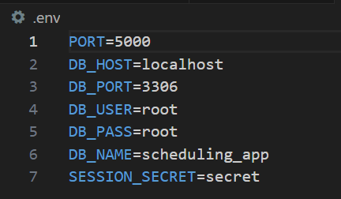

# Backend Setup and API Usage Guide

The purpose of the backend is to connect the frontend with the backend without direct access. The backend acts as the intermediary between the user interface and the database, as the API is what makes direct calls to database. The API Routes will be developed in visual studio code using Express.JS.

NOTE: The backend server will have to be run as a separate program in the background, simply running the frontend (either Android or iOS) application will not work.

## Steps for setting up the backend:
- Install Node and MySQL Workbench on your device
- Run the **local_db_initialization** SQL script (located in the database directory of this project) in MySQL Workbench to initialize your local database.
- Navigate to the backend directory in a terminal and run **npm install** to install the required node modules.
- Create and set up your .env file in the backend directory to set your environment variables. The .env file should look something like this:

- Run **npm start** and the server will start up and connect to the local database.
- Once the backend server is running, you can use either the Android or iOS version of the app.

## API Usage

### Authentication Routes

### Task Routes
